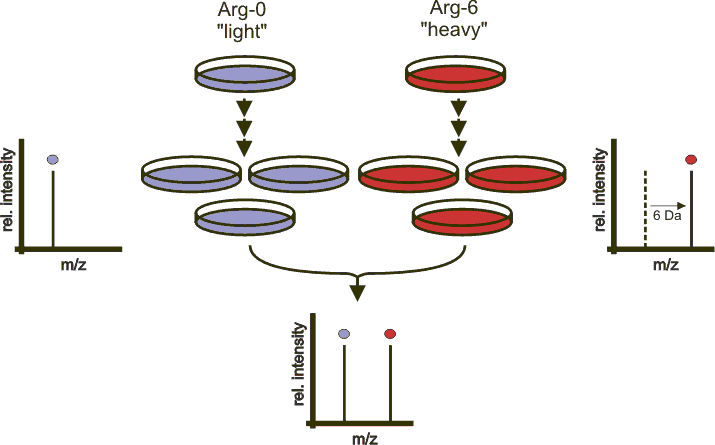
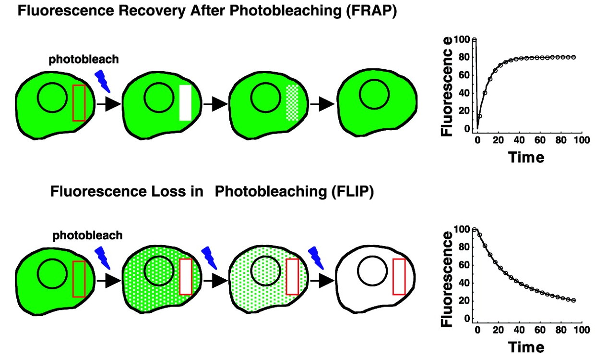

# BioDataProcess

I wrote python scripts in **iPython notebook** to process and analyze data collect from my biomedical bench work.

* SILAC Mass spectrometry data processing script

SILAC (Stable Isotope Labeling by/with Amino acids in Cell culture) is a technique based on mass spectrometry that detects differences in protein abundance among samples using non-radioactive isotopic labeling. It is a popular method for quantitative proteomics. 

* FRAP & FLIP microscopic video analyzing script

Fluorescence Recovery After Photobleaching (FRAP) & Fluorescence Loss In Photobleaching (FLIP): In this type of experiments, information about molecular complex formation is obtained from diffusion rates. Fluorescently tagged proteins are locally photobleached by brief, intensive laser excitation and from the kinetics of recovery of fluorescence (due to diffusion of fluorophores from neighboring areas) diffusion rates and mobile fraction can be calculated. This yields information on protein size- and geometry, complex formation, viscosity and binding to immobile structures such as focal adhesions. 

In a FLIP experiment, a fluorescent cell is repeatedly photobleached within a small region while the whole cell is continuously imaged. Any regions of the cell that are connected to the area being bleached will gradually lose fluorescence due to lateral movement of mobile proteins into this area. By contrast, the fluorescence in unconnected regions will not be affected. In addition to assessing continuity between areas of the cell, FLIP can be used to assess whether a protein moves uniformly across a particular cell compartment or undergoes interactions that impede its motion. Finally, FLIP can be used to reveal faint fluorescence in unconnected compartments that normally cannot be seen against the bright fluorescence from other parts of the cell.

